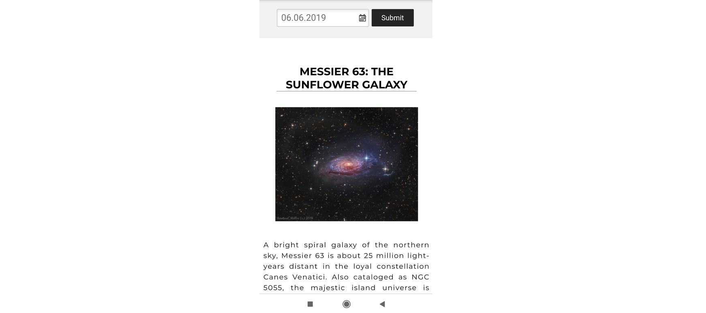

# NASA - Photo Of The Day

## Table of contents
* [General info](#general-info)
* [Technologies](#technologies)
* [Setup](#setup)
* [Status](#status)
* [Contact](#contact)

## General info
Simple application using NASA API - including astronomical photos.

## Technologies
* HTML5
* CSS
* React JS
* Webpack
* API
* Firebase
* PWA

## Setup
To run this project, install it locally using npm:

* Clone this repository
$ git clone https://github.com/ewelina-slepko/NASA-picture-of-the-day

* Go into the repository
$ cd NASA-picture-of-the-day

* Install dependencies
$ npm install

* Run the app
$ npm start

* Progressive Web App - 
The Application [page](https://nasa-get-the-photo.firebaseapp.com/) is served as a PWA, so you can use it offline on your phone.

## Status
Project is: _in progress_.

## Contact
Created by Ewelina Ślepko (slepko.ewelina@gmail.com) - feel free to contact me!
